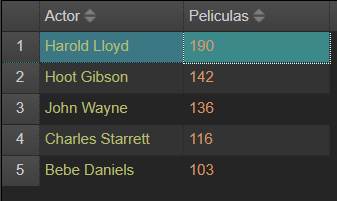

# 📃 NoSQL Module - MongoDB Project

> Final project for the **NoSQL Module** of the Master's in Big Data, Data Science & AI.
> Developed by **Claudia del Pozo Iglesias** using **MongoDB Compass** and **NoSQLBooster**.

---

## 📚 Description

This project covers the complete manipulation of a MongoDB collection using a dataset of movies. Each exercise follows academic requirements, demonstrating:

* Data import
* Querying with `find()`
* Updates and deletions
* Aggregation pipelines
* Creation of additional collections via `$unwind`

All queries include corresponding screenshots with the results.

---

## 🗃️ Exercise Descriptions and Screenshots

### **0. Import the JSON file into a collection called `movies`**

Used MongoDB Compass to import `movies.json`. Result: 28,795 documents successfully imported.


---

### **1. Explore the dataset using `find()`**

Simple query to inspect structure:

```js
db.movies.find().limit(1)
```


---

### **2. Count total documents in `movies`**

```js
db.movies.countDocuments()
```

Returns total number of movies.


---

### **3. Insert a new movie**

```js
db.movies.insertOne({
  title: "The Silence of the Lambs",
  year: 1991,
  cast: ["Anthony Hopkins", "Jodie Foster"],
  genres: ["Horror", "Crime"]
})
```


---

### **4. Delete the inserted movie**

```js
db.movies.deleteOne({ title: "The Silence of the Lambs" })
```


---

### **5. Count how many movies have an actor called "and"**

```js
db.movies.countDocuments({ cast: "and" })
```


---

### **6. Remove "and" from the cast array**

```js
db.movies.updateMany(
  { cast: "and" },
  { $pull: { cast: "and" } }
)
```


---

### **7. Count how many documents have empty cast**

```js
db.movies.countDocuments({ cast: { $size: 0 } })
```


---

### **8. Update all empty casts with \["Undefined"]**

```js
db.movies.updateMany(
  { cast: { $size: 0 } },
  { $set: { cast: ["Undefined"] } }
)
```


---

### **9. Count how many documents have empty genres**

```js
db.movies.countDocuments({ genres: { $size: 0 } })
```


---

### **10. Update all empty genres with \["Undefined"]**

```js
db.movies.updateMany(
  { genres: { $size: 0 } },
  { $set: { genres: ["Undefined"] } }
)
```


---

### **11. Show the most recent year in the dataset**

```js
db.movies.find().sort({ year: -1 }).limit(1)
```


---

### **12. Count how many movies were released in the last 20 years**

```js
db.movies.aggregate([
  { $match: { year: { $gte: 2003 } } },
  { $count: "total" }
])
```


---

### **13. Count movies from the 1960s**

```js
db.movies.aggregate([
  { $match: { year: { $gte: 1960, $lte: 1969 } } },
  { $count: "total" }
])
```


---

### **14. Year(s) with the most movies**

```js
db.movies.aggregate([
  { $group: { _id: "$year", count: { $sum: 1 } } },
  { $sort: { count: -1 } },
  { $limit: 1 }
])
```


---

### **15. Year(s) with the fewest movies**

```js
db.movies.aggregate([
  { $group: { _id: "$year", count: { $sum: 1 } } },
  { $sort: { count: 1 } },
  { $limit: 1 }
])
```


---

### **16. Unwind cast and save to new collection `actors`**

```js
db.movies.aggregate([
  { $unwind: "$cast" },
  { $out: "actors" }
])
```



---

### **17. Top 5 actors with most movies (excluding "Undefined")**

```js
db.actors.aggregate([
  { $match: { cast: { $ne: "Undefined" } } },
  { $group: { _id: "$cast", count: { $sum: 1 } } },
  { $sort: { count: -1 } },
  { $limit: 5 }
])
```


---

### **18. Top 5 movies with most actors**

```js
db.actors.aggregate([
  { $group: { _id: { title: "$title", year: "$year" }, count: { $sum: 1 } } },
  { $sort: { count: -1 } },
  { $limit: 5 }
])
```


---

### **19. 5 actors with the longest careers**

```js
db.actors.aggregate([
  { $match: { cast: { $ne: "Undefined" } } },
  { $group: {
      _id: "$cast",
      start: { $min: "$year" },
      end: { $max: "$year" },
      span: { $sum: 1 }
  } },
  { $project: {
      begins: "$start",
      ends: "$end",
      years: { $subtract: ["$end", "$start"] }
  } },
  { $sort: { years: -1 } },
  { $limit: 5 }
])
```


---

### **20. Unwind genres and create `genres` collection**

```js
db.actors.aggregate([
  { $unwind: "$genres" },
  { $out: "genres" }
])
```


---

### **21. Top 5 (Year + Genre) with most distinct movies**

```js
db.genres.aggregate([
  { $group: {
      _id: { year: "$year", genre: "$genres" },
      movies: { $addToSet: "$title" }
  } },
  { $project: {
      count: { $size: "$movies" }
  } },
  { $sort: { count: -1 } },
  { $limit: 5 }
])
```


---

### **22. Top 5 actors with the widest genre variety**

```js
db.genres.aggregate([
  { $match: { cast: { $ne: "Undefined" } } },
  { $group: {
      _id: "$cast",
      genres: { $addToSet: "$genres" }
  } },
  { $project: {
      numGenres: { $size: "$genres" },
      genres: 1
  } },
  { $sort: { numGenres: -1 } },
  { $limit: 5 }
])
```


---

### **23. Top 5 movies with most genre diversity**

```js
db.genres.aggregate([
  { $group: {
      _id: { title: "$title", year: "$year" },
      genres: { $addToSet: "$genres" }
  } },
  { $project: {
      numGenres: { $size: "$genres" },
      genres: 1
  } },
  { $sort: { numGenres: -1 } },
  { $limit: 5 }
])
```


---

## 🔗 PDF Report

Full explanation and screenshots can also be found in the attached document:

* [`Claudia del Pozo Iglesias.pdf`](./Claudia%20del%20Pozo%20Iglesias.pdf)

---

## 👩‍💼 Author

**Claudia del Pozo Iglesias**
Master's in Big Data, Data Science & AI
[LinkedIn](https://www.linkedin.com/in/claudiadelpozo)

---

## 📌 License

This repository is part of a personal academic project and is released under the MIT license.
